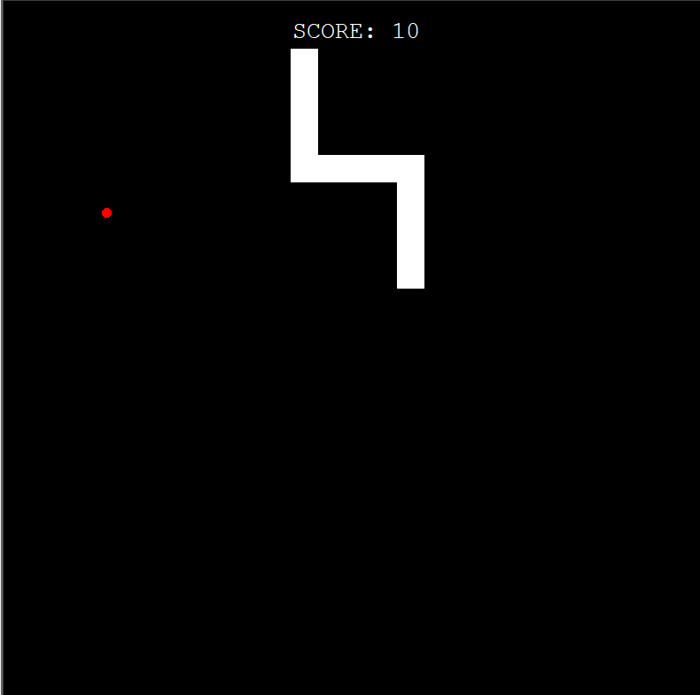

# Snake Game in Python



## Overview

This project is a basic implementation of the classic Snake game using Python and the Turtle graphics library. The game includes a snake that grows longer as it consumes food, and it features a simple scoring system.

## Features

- Snake movement controlled by arrow keys.
- Growing snake length upon eating food.
- Game over when the snake collides with the screen borders or itself.

## Getting Started

1. **Clone the repository:**

    ```bash
    git clone https://github.com/kibshh/snake_game.git
    cd snake_game
    ```

2. **Run the game:**

    ```bash
    python main.py
    ```

3. **Controls:**

   - Up: Arrow Up
   - Down: Arrow Down
   - Left: Arrow Left
   - Right: Arrow Right

## Configuration

You can customize the game configuration by modifying the `config.py` file. Adjust screen dimensions, colors, game speed, and other settings according to your preferences.

## Additional Information

The project is organized into separate modules for different components of the game, making it easy to understand and extend. Explore and modify the code to enhance or adapt the game to your liking.

Have fun playing Snake!

## License

This project is licensed under the MIT License - see the [LICENSE](LICENSE) file for details.
